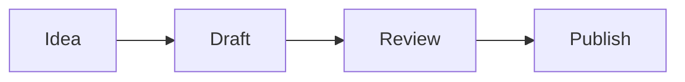

# AI

Source: concepts/ai.md
URL: /concepts/ai

# AI

Tolaria has two AI paths: coding agents that can use tools to inspect and edit a vault, and direct model targets that answer in chat mode from note context.

## Coding Agents

The AI panel can stream supported local CLI agents through Tolaria's normalized event layer. Current targets include Claude Code, Codex, OpenCode, Pi, and Gemini CLI when they are installed on the machine.

Coding agents can run in:

- **Vault Safe** mode, limited to file, search, and edit tools.
- **Power User** mode, which can allow local shell commands scoped to the active vault for agents that support shell access.

## Direct Models

Direct model targets run in chat mode. They receive the active note, linked context, and conversation history, but they do not receive vault-write tools or shell access.

Supported provider shapes include:

- Local models through Ollama or LM Studio.
- Hosted providers such as OpenAI, Anthropic, Gemini, and OpenRouter.
- Custom OpenAI-compatible endpoints.

## External MCP Setup

Tolaria exposes an MCP server for external tools. The setup flow can write Tolaria's MCP entry into Claude Code, Gemini CLI, Cursor, and a generic MCP config path, and it can also copy the exact JSON snippet for manual setup.

MCP setup is explicit. Closing the dialog leaves third-party config files untouched.

## Why Git Matters For AI

AI-generated changes should be inspectable. Git gives you diffs, history, rollback, and a clear boundary between suggestions and committed work.

---

# Editor

Source: concepts/editor.md
URL: /concepts/editor

# Editor

Tolaria offers a rich editor for daily writing and a raw Markdown mode for exact file control. Both modes write back to the same Markdown file.

## Rich Editing

The rich editor supports blocks, slash commands, wikilinks, tables, code blocks, images, Mermaid diagrams, LaTeX-style math, and markdown-backed whiteboards.

Use it when you want to write and reorganize quickly without thinking about Markdown syntax.

## Raw Mode

Raw mode shows the Markdown source directly. Use it when you need to edit YAML frontmatter, repair unusual Markdown, or make an exact text change.

Toggle raw mode with `Cmd+\` on macOS or `Ctrl+\` on Windows and Linux.

## Table Of Contents

The table of contents panel builds an outline from headings in the current note. It is useful for long notes, procedures, research files, and generated documents. Toggle it with `Cmd+Shift+T` on macOS or `Ctrl+Shift+T` on Windows and Linux.

## Width

Notes can use normal or wide editor width. Set the default in Settings, or override an individual note from the editor toolbar.

---

# Files And Media

Source: concepts/files-and-media.md
URL: /concepts/files-and-media

# Files And Media

Tolaria starts with Markdown notes, but a vault can also contain images, PDFs, media files, whiteboards, and other local files.

## Mermaid Diagrams

Use Mermaid code blocks when a note needs a diagram that should stay plain text and versionable.

````md

````

Tolaria renders Mermaid diagrams in the editor while keeping the source in Markdown.

## Attachments

Images pasted into the editor are saved into the vault as normal files. They remain portable and can be opened by other tools.

## Previews

Tolaria can preview common image files, PDFs, and supported media files in the app. Files without an in-app preview can still be opened in the default system app.

Settings control whether PDFs, images, and unsupported files appear in All Notes. Folder browsing still shows files in their folders.

## Whiteboards

Whiteboards use tldraw in the editor, but their durable representation stays in Markdown. That keeps them inside the vault and versioned by Git with the rest of your notes.

## Git Boundary

If generated or local-only files are ignored by Git, Tolaria can hide them from notes, search, quick open, and folders. Use this when build artifacts or private local files should not behave like vault content.

---

# Git

Source: concepts/git.md
URL: /concepts/git

# Git

Git is Tolaria's recommended history and sync layer. Tolaria can work with plain Markdown folders, and Git unlocks local history, recovery, remote backup, and multi-device workflows when you want them.

Tolaria acts as a lightweight Git client for your vault. You can review changes, commit, pull, push, and inspect history without leaving the app.

## What Tolaria Uses Git For

- Whole-vault commit history.
- Current diff for the vault.
- Per-note history.
- Current diff for an individual note.
- Pull and push.
- Conflict detection and resolution.
- Remote connection for local-only vaults.

## History And Diffs

Each note can show its own history and current diff, so you can understand how that file changed over time or what is unsaved relative to Git.

Tolaria also shows a history of the whole vault. Use it when you want to review broader changes across multiple notes before committing or syncing.

## Local Commits

You can commit changes inside Tolaria without leaving the app. This gives you useful restore points even before a remote is configured.

## Remotes

Connect a compatible Git remote when you want sync or backup. Tolaria relies on your system Git authentication, so GitHub CLI, SSH keys, credential helpers, and existing Git configuration can continue to work.

---

# Inbox

Source: concepts/inbox.md
URL: /concepts/inbox

# Inbox

The Inbox is for notes that have been captured but not yet organized.

## Why It Exists

Fast capture should not require perfect structure. The Inbox gives you a place to put incomplete notes, then process them later.

The Inbox workflow is optional. Turn it off in Settings > Workflow if you prefer every note to appear organized by default.

## Organizing Inbox Notes

When reviewing the Inbox:

1. Give the note a clear H1.
2. Set its `type`.
3. Add status, dates, or URL if useful.
4. Add relationships with wikilinks or frontmatter fields.
5. Move it into a folder only if the folder adds value.

## Healthy Inbox Habit

Keep the Inbox small enough that it can be reviewed in one focused pass. Tolaria works best when capture is fast and organization is deliberate.

---

# Notes

Source: concepts/notes.md
URL: /concepts/notes

# Notes

A note is a Markdown file with optional YAML frontmatter. Tolaria reads the first H1 as the primary title and keeps the file on disk as the durable representation.

## Anatomy

```md
---
type: Project
status: Active
belongs_to:
  - "[[workspace]]"
---

# Launch Documentation

Draft the public Tolaria docs and keep them close to code changes.
```

## Titles

The first H1 is the note title. Tolaria uses that title wherever the note is displayed: note lists, search results, wikilink suggestions, relationship pickers, tabs, and window titles.

The title is separate from the filename. The filename stays visible in the breadcrumb so you can see the file on disk, and you can rename it independently when needed.

Use the breadcrumb action to rename the file to match the title. New untitled notes can also auto-rename from the first H1 the first time they get a real title. Turn this behavior off in Settings > Vault Content > Titles & Filenames if you prefer filenames to stay unchanged until you rename them manually.

## Body Links

Use `[[wikilinks]]` to connect notes from the body. Tolaria shows autocomplete suggestions while you type, and links can resolve by filename or title.

## Frontmatter

Use frontmatter for structured fields such as type, status, date, URL, and relationships. Keep free-form thinking in the body.

---

# Properties

Source: concepts/properties.md
URL: /concepts/properties

# Properties

Properties are frontmatter fields that Tolaria can display, filter, and edit.

## Suggested Properties

Suggested properties are the fields Tolaria knows how to create quickly from the Properties panel. When a suggested property is missing, the panel shows a shortcut to add it with the right editor.

| Field | Purpose |
| --- | --- |
| `type` | Groups the note into a type such as Project, Person, or Topic. |
| `status` | Tracks lifecycle state such as Active, Done, or Blocked. |
| `url` | Stores a canonical external link. |
| `date` | Represents a single date. |

## System Properties

Fields that start with `_` are system properties. They remain in plain text but are hidden from normal property editing.

Examples include `_icon`, `_color`, `_order`, `_sidebar_label`, `_width`, and `_pinned_properties` on type documents or notes.

## Property Editing

The Properties panel is the safest place to edit structured properties. Toggle it with `Cmd+Shift+I` on macOS or `Ctrl+Shift+I` on Windows and Linux.

Date fields use Tolaria's picker, relationship fields can use wikilinks, and raw Markdown mode is available when you need direct control over YAML.

---

# Relationships

Source: concepts/relationships.md
URL: /concepts/relationships

# Relationships

Relationships make a vault feel like a graph instead of a pile of documents.

## Relationship Fields

Any frontmatter field containing wikilinks can become a relationship. Relationship fields can point to one note or to an array of notes.

```yaml
belongs_to:
  - "[[product-work]]"
related_to:
  - "[[documentation]]"
  - "[[editor-research]]"
blocked_by:
  - "[[release-process]]"
  - "[[sync-conflicts]]"
```

Tolaria supports default relationship fields out of the box: `belongs_to`, `has`, and `related_to`. It also detects custom relationship fields dynamically when they contain wikilinks.

Default relationships have automatically computed inverses. If a note says it `belongs_to` a project, the project can show that note under its inverse `has` relationship without you writing the reverse link by hand. `related_to` works as a lateral relationship in both directions.

These outgoing and inverse relationships appear in the Properties panel and in Neighborhood mode, where the note list becomes a graph view around the selected note.

## Body Links Versus Relationship Fields

Use body links when the relationship appears naturally in writing. Use frontmatter relationships when the connection is important enough to show in navigation, filters, Neighborhood mode, or the Properties panel.

## Backlinks

Tolaria can show incoming links and inverse relationships, making it easier to navigate from a note to the rest of its context.

---

# Types

Source: concepts/types.md
URL: /concepts/types

# Types

Types describe what kind of thing a note represents: Project, Person, Topic, Procedure, Event, or any category you create.

## Type Field

The `type:` field assigns a note to a type.

```yaml
type: Project
```

Tolaria does not infer type from folder location. Moving a file into another folder does not change its type.

## Prefer Types Over Folders

Types are the preferred way to group notes in Tolaria. Folders are supported for existing vaults and fallback organization, but Tolaria is built around types and relationships because they carry stronger meaning than file paths.

Use types for semantic groups such as Projects, People, Topics, Procedures, Events, and Essays. Use relationships to connect notes across those groups. This gives Tolaria better structure for navigation, filtering, properties, templates, and future automation than folder location alone.

## Type Documents

Type documents are Markdown notes with `type: Type` in frontmatter. They describe how a type should appear and what new notes of that type should start with.

```yaml
---
type: Type
_icon: folder
_color: blue
_sidebar_label: Projects
_order: 10
---

# Project
```

## What Types Control

- Sidebar grouping.
- Type icon and color.
- Sidebar order and label.
- Pinned properties.
- New-note templates.

## New Note Defaults

Type documents can define empty properties and relationships. When you create a new note of that type, Tolaria shows placeholders for those fields so you can fill them in from the Properties panel.

If a type document gives a property a value, that value becomes the default for new notes of that type. For example, a Project type can define `status: Active` so every new project starts active until you change it.

---

# Vaults

Source: concepts/vaults.md
URL: /concepts/vaults

# Vaults

A vault is the folder Tolaria reads and writes. The filesystem is the source of truth; the app state and cache are derived from files.

## Core Rules

- Notes are Markdown files.
- YAML frontmatter provides structure.
- Attachments are normal files inside the vault.
- Type definitions and saved views are also files.
- Git can track history and support remote sync.

## Why Local Files Matter

Local files keep your notes inspectable. You can open them in another editor, search with command-line tools, back them up with your own system, and version them with Git.

Tolaria should never become the only way to read your data.

## Git Is A Capability

A plain folder of Markdown files can open as a vault. Git-backed vaults unlock history, changes, commits, pull, push, conflict handling, and remote setup.

If a folder is not a Git repository, Tolaria can initialize Git when you explicitly ask it to. It avoids initializing broad personal folders such as Desktop, Documents, or Downloads unless they are clearly dedicated vault folders.

## Multiple Vaults At The Same Time

Tolaria can load multiple registered vaults into one unified graph. Enable this from `Settings` -> `Vaults` -> `Use multiple vaults at the same time`.

After the option is enabled, open the bottom-left vault menu to include or exclude vaults from the graph. Included vaults appear together in note lists, search, quick open, backlinks, and wikilink navigation. Each note keeps a compact vault badge when Tolaria needs to disambiguate where it lives.

The selected vault still matters. Git status, commits, sync, folder navigation, saved views, and vault repair actions stay scoped to the current repository. Use `Manage vaults` from the vault menu or the Vaults settings section to rename vaults, choose colors, and set the default destination for new notes.

Cross-vault wikilinks use the target vault's stable alias when needed, for example `[[team/projects/alpha]]`. Links inside the same vault stay normal vault-relative links.

## App State Versus Vault State

Vault-level information should travel with the vault. Machine-specific preferences stay with the app installation.

| Vault state | App state |
| --- | --- |
| Type icons and colors | Editor zoom |
| Saved views | Window size |
| Pinned properties | Recent vault list |
| Relationship conventions | Local cache |
| Vault AI guidance files | AI target selection |